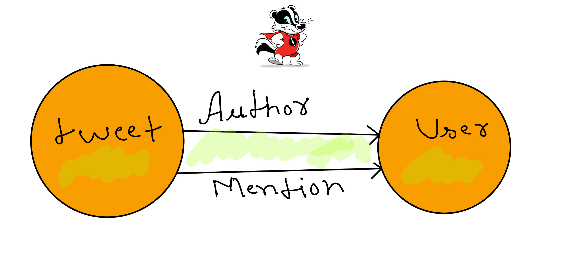
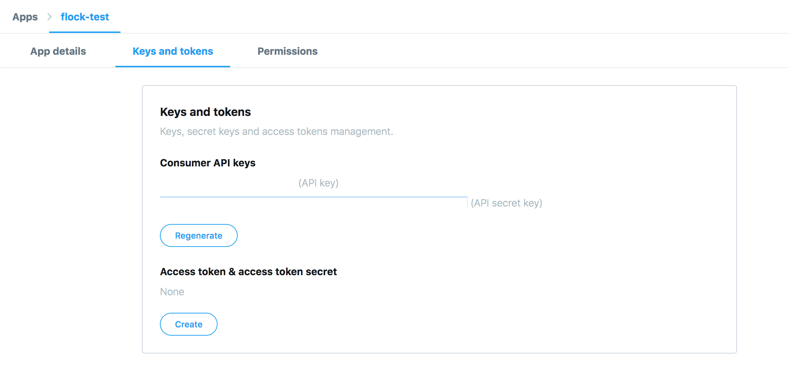

# Flock 

Flock loads real Twitter streams into Dgraph to make use of graph traversals.

**Use [Discuss Issues](https://discuss.dgraph.io/tags/c/issues/35/flock) for reporting issues about this repository.**

Flock has two parts, 
- *Tweet loader* - Connects to [realtime Tweets][tweetsapi] via the Twitter Developer API and
loads a graph model of Twitter into Dgraph via mutations.
- *Query client* - Runs interesting graph queries on the Tweets data stored in Dgraph.

Here is the graph schema of Flock:



[tweetsapi]: https://developer.twitter.com/en/docs/tweets/sample-realtime/overview/GET_statuses_sample

# Running Flock

## Obtaining Twitter credentials

We need to create a Twitter developer account and an app to be able to fetch stream of Tweets using 
their APIs. Let's start with how to create a Twitter developer account.

- Apply for a Twitter developer account [here](https://developer.twitter.com/en/apply/user) and 
  follow the instructions. The series of steps would end with your email verification.
- Create a Twitter app from [this link](https://developer.twitter.com/en/apps/create). 
  All fields are `not` required.
- You'll be redirected to the App details tab after creating the app. Go to the `Keys and tokens` tab
   and create new access and secret tokens.

- Create a copy of the credentials template.
  ```sh
  cp credentials-template.json credentials.json
  ```
- Open the `credentials.json` file and replace the placeholders with the keys from the 
  Twitter app's `Keys and token` tab.

---
## Setup

- Clone the repository.
```sh
$ git clone https://github.com/dgraph-io/flock.git
$ cd flock
```

- Export the persistent data directory. Since Dgraph is run using Docker containers, it is nice
  to mount a directory on the host machine to persist the data across multiple runs.
```sh
$ mkdir ./data
$ export DATA_DIR=$(pwd)/data
```

- If you're running Linux, you can add the current user to the `docker` group to use Docker as a non-root user.
  `newgrp` creates a new terminal session. It is necessary after the user modification to see the effects.

```sh
$ sudo usermod -aG docker $USER
$ newgrp docker
```

- Start the Dgraph servers and Ratel with Docker Compose. Visit http://localhost:8000 on your 
  browser to view the UI.
  
```sh
$ docker-compose up
```

## Running Flock

Currently, we have Flock implementation for Go and JavaScript.

Go to the specific Flock documentation for instructions:

- [Go](./go)
- [JavaScript](./js)

---
