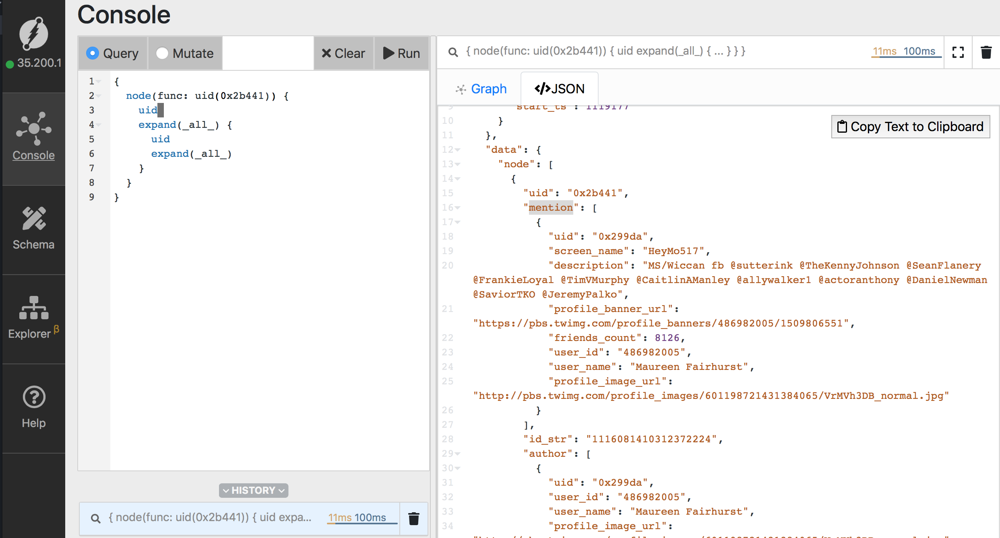

## Flock
Twitter on Dgraph. Pulls twitter data from its open APIs and stores it into Dgraph.  

## Motivation
The goal of the project is to build an interesting use case around Dgraph with a focus on developer 
experience. The docker-compose setup gets you up and running and flock let's you explore Dgraph's 
capabilities on the real twitter stream.

## Table of Contents
- [Obtaining the twitter credentials](#Obtaining-twitter-credentials)
- [Running Flock](#Setup)
- [Welcome to Dgraph](#Welcome-to-Dgraph)
- [Terminologies](#Terminologies)
- [Introduction to Ratel](#Introduction-to-Ratel)
- [Data Modeling](#Twitter-data-Modeling)
- [Queries](#queries)
- [Creating indexes](#Creating-indexes)
- [Using client libraries](#Client-libraries)
---

## Obtaining twitter credentials

One need to have a twitter developer account and an app to be able to fetch stream of tweets using 
their APIs. Let's start with how to create a twitter developer account.

- Apply for a twitter developer account [here](https://developer.twitter.com/en/apply/user) and 
  follow the instructions. The series of steps would end with your email verification.
- Create a twitter app from [this link](https://developer.twitter.com/en/apps/create). 
  All fields are not `required`.  
- You'll be redirected to the App details tab after creating the tab. Go the `Keys and tokens` tab
   and create new access and secret tokens.

- Create a copy of the credentials template.
  ```sh
  mv credentials-template.json ./tutorials/credentials.json
  ```
- Open the `tutorials/crendentials.json` file and replace the placeholders with the keys from the 
  twitter app's `Keys and token tab`.

---
## Setup

- Clone the repository.
```sh
$ git clone https://github.com/dgraph-io/flock.git
$ cd flock/tutorial
```

- Export the persistent data directory. Since Dgraph is run using Docker containers, it is essential
  to mount a directory on the host machine to persist the data across multiple runs.
```sh
$ mkdir ./data
$ export DATA_DIR=$(pwd)/data
```

- Export UID. This is to give permissions to Dgraph process inside the container to write to host directory.   
```sh
$ export UID
```

- This command adds the current user to docker group so that docker command line tool can write to 
  unix socket where docker daemon is listening.
  You should logout and login the host again, after called the command.
```
$ sudo usermod -aG docker $USER
```

- Start the Dgraph servers, flock and Ratel with Docker-compose. Visit localhost:8000 on your 
  browser to view the UI.
```sh
$ docker-compose up
```
---

## Welcome to Dgraph.
The docker compose setup runs Dgraph servers and fetches the data from twitter stream and stores 
them in Dgraph. Here's where you'll see that modeling your data with a GraphDB differs from 
SQl and NO-SQL databases, welcome to relationship first approach with Dgraph! Using Flock, 
here's how the data from the twitter stream is modeled.

**TODO: Illustration required to showcase the Model of twitter stream in Dgraph.**  

Graph databases store data by retaining its connected representation. This lets you discover 
connections and relationships which are not possible with SQL or NO-SQL databases. Imagining and 
modeling the real world data in its natural connected form is more intuitive than trying hard to 
squeeze it in a tabular format as rows and tables. The denormalized modeling of NO-SQL databases 
are even less effective than SQL. These inherent capabilities of a GraphDB combined with ease of 
use, performance and scalability of Dgraph let's you model easily, develop applications faster and 
discover relationships which could empower one to have feature sets which were not possible before 
in real time.

---
## Terminologies
- Predicates
- Mutation
- Facets

---

## Introduction to Ratel
Ratel is the user interface to run queries and mutations on Dgraph.


---

## Twitter data Modeling
Flock pulls the tweets from the stream and organizes the fields. There are essentially two types of
 nodes. User and Tweet nodes. Here are predicates/properties in the Twitter User node.

```go
twitterUser{
  UID              string
  UserID           string
  UserName         string
  ScreenName       string  
  Description      string
  FriendsCount     int    
  Verified         bool   
  ProfileBannerURL string
  ProfileImageURL  string
}   
```

Here are predicates/properties in the Tweet node.
```go
{
  UID       string        
  IDStr     string        
  CreatedAt string       
  Message   string        
  URLs      []string      
  HashTags  []string  

  Retweet   bool
}         

```
Here's twitter data is modeled in Dgraph.
- `Author` edge is drawn from a tweet node to a `twitter user node` everytime a user tweets.
- `Mention` also is a edge which connects a `tweet node` to an `user node` everytime there's a 
   mention in the tweet.

```go
{
  UID       string        
  IDStr     string        
  CreatedAt string       
  Message   string        
  URLs      []string      
  HashTags  []string  
  # Author is an edge from tweet to the twitterUser node .    
  Author    twitterUser{
    UID              string
    UserID           string
    UserName         string
    ScreenName       string
    Description      string
    FriendsCount     int    
    Verified         bool   
    ProfileBannerURL string
    ProfileImageURL  string
  }   
  # Mention in an edge from tweet to twitter user node.
  Mention   twitterUser{
    UID              string
    UserID           string
    UserName         string
    ScreenName       string
    Description      string
    FriendsCount     int    
    Verified         bool   
    ProfileBannerURL string
    ProfileImageURL  string
  }
  Retweet   bool
}         
```

---

## Creating indexes


---
## Client libraries


---
