# Getting started with Dgraph

---
# Table of contents
- [About Dgraph](#about-Dgraph)
- [Installing and Running Dgraph](#installing-and-running-dgraph)
- [Concepts](#concepts)
- [Getting Started](#getting-started)
- [Wrapping up](#wrapping-up)

---

# About Dgraph

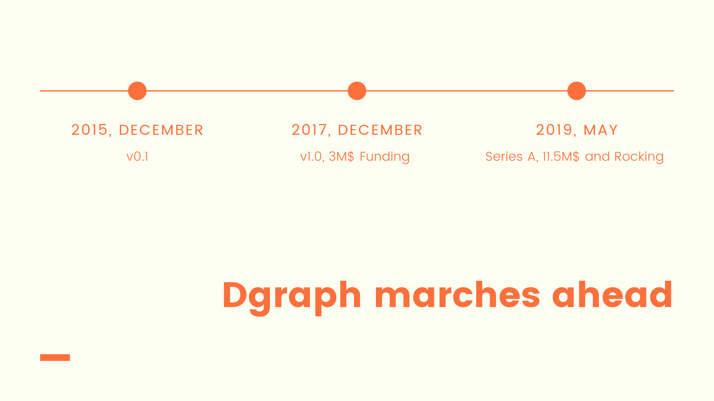

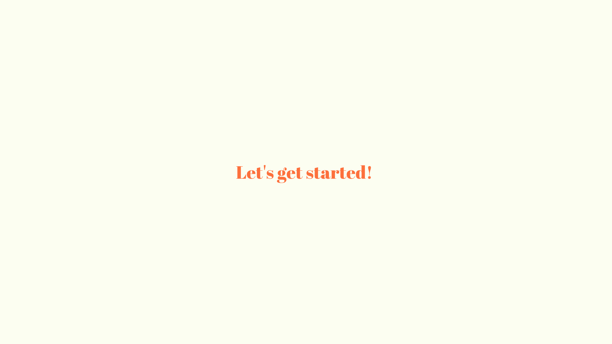

---

# Installing and running dgraph

## Using the binary 
- Use the installation script.
  ```sh
  $ curl https://get.dgraph.io -sSf | bash
  ```

- Run Dgraph servers
  
 ```sh
  $ dgraph zero
  $ dgraph alpha --lru_mb 2048 --zero localhost:5080
  $ dgraph-ratel
  ```
  You could even run it by explicity mentioning the data directories, this helps when you want to 
  have a fresh start for a new experiment, just in case..
 
  ```sh
  $ mkdir ./dgraph
  $ dgraph zero -w dgraph/w
  $ dgraph alpha --lru_mb 2048 -p dgraph/p -w dgraph/w --zero localhost:5080
  ```
 
## Using docker-compose 
- Download the `docker-compose.yml` present in this folder.
- Export the persistent data directory. Since Dgraph is run using Docker containers, it is essential
  to mount a directory on the host machine to persist the data across multiple runs. 
```sh
$ mkdir ./data
$ export DATA_DIR=$(pwd)/data
```
- Export UID. This is to give permissions to Dgraph process inside the container to write to host directory.   
```sh
$ export UID
```

- This command adds the current user to docker group so that docker command line tool can write to 
  unix socket where docker daemon is listening.
  You should logout and login the host again, after called the command.
```
$ sudo usermod -aG docker $USER
```

- Run `docker-compose -f compose-dgraph.yml up`

---

# Concepts
## Alpha (WIP)

Hosts edges(predicates) and indexes.

##Zero  
Controls the Dgraph cluster, assigns servers to a group and re-balances data between server groups.

## Node
Nodes and Relationships are the fundamental units of abstraction in a Graph database. 

## Edges / Relationships
The nodes would be connected by an edges or edges, they represent the relationship between the nodes.

Dgraphs horizontal scaling capability allows one to create millions or even billions or nodes and relationships. 

## Traversals 
Thought it's possible to create nodes without any relationships between them, relationships are 
first class citizens in Dgraph, by not utilizing the relationships and traversals across them you 
would be losing out on making use of the true potential of Dgraph. 

Traversing the edges or the relationships between the nodes helps to identify and discover the 
hidden patterns in your data and thus this allows one to extract more value from the data. 


# Getting Started
## Step 1: Get your application graph on paper. 
The power of a graph model emerge from the fact that its simple to translate the white board model 
or the mental model onto your database model. Let's draw a simple graph and build it on Dgraph. 

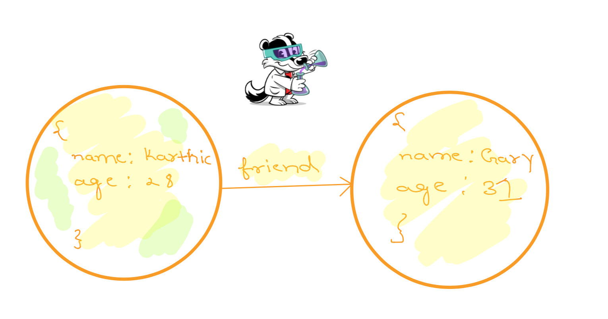

## Creating the Dgraph schema 
- Let's list down the unique properties of the graph with their types. 


```sh
name: string 
age: int
friend: Is an edge (uid) 
```

- We have almost nailed the Dgraph schema! 

```
name: string 
age: int
friend: uid
```

- int, string, float, bool, geo, dateTime, uid are the types available in Dgraph.

- Schema's are flexible in Dgraph, you could modify them anytime. 

## Creating indexes
- Indexes help you speed up operations on the specified fields. 
- For example, if you think your applications feature need a capability to search a user by 
  their `name`, creating index on the `name` field would be a good idea. The same applies to other 
  fields in your application data graph and edges too. 
- The index for a field has to be mentioned in its schema with the `@index(<index-type>)` format.
- Let's add an index to each of the 3 fields in our schema. 

```sh
name: string @index(term) @lang .
age: int @index(int) .
friend: uid @count .
```

- For the data types int, float, bool and geo each: Their index types are also named named int, 
  float, bool and geo. Types string and dateTime have a number of index types.

- The edges (represented by type uid in schema) also have special indices. The @count index helps 
  to achive an efficient operation to count the number of edges.

- In the sessions to follow we would discusss in detail about different types of index and their 
  relevance. 

- Let's use Ratel to perform the first set of operations. Go to `localhost:8000`. Welcome to Ratel. 

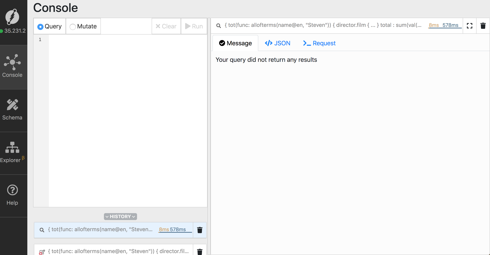

- Click on Schema -> Bulk Edit -> Paste your schema -> Apply

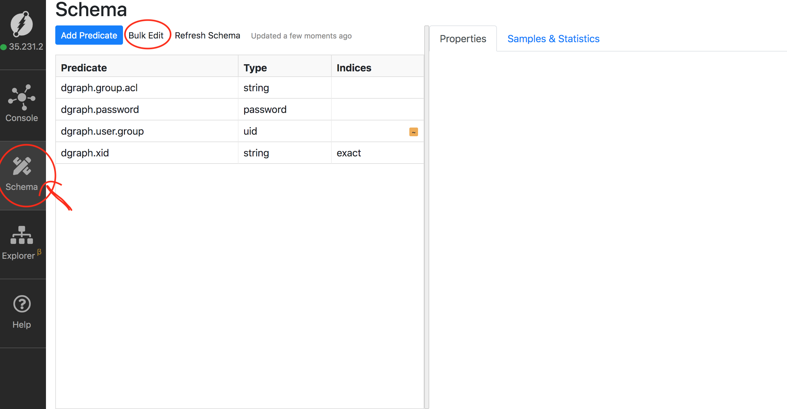
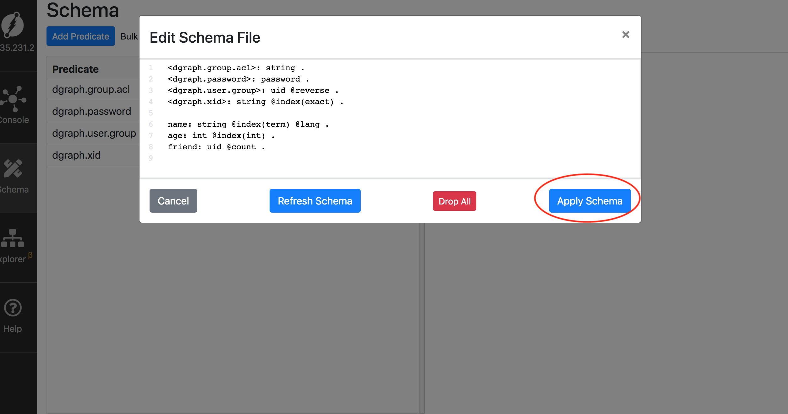

## Creating a node.
Let's create a node and set values for the `name` and `age` properties/predicates. 

Create, Update and Delete operations are called `mutations` and the read operations are called `queries`. 

This is the Node we would want to create, with name set to Karthic and age set to 28. 


Click on the `Mutate` radio button, paste the mutation below and hit the `Run` button.

```sh
{
  set {
    _:node1 <name> "Karthic" .
    _:node1 <age> "27" .
  }
}
```

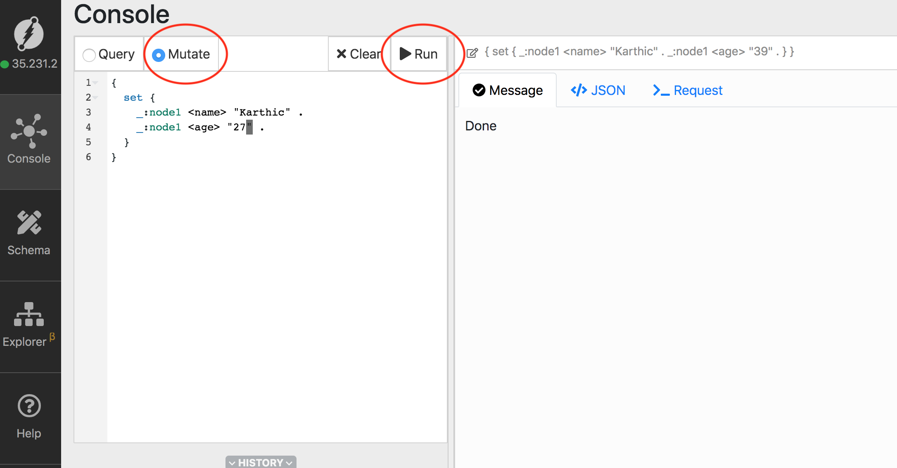

Here is the format of the above mutation 

```sh
{
  set {
    _:temporary_node_reference <property/predicate> "Value" .
  }
}
```

The temporary node reference could be named anything(Doesn't follow a sequence), it would be 
converted into an unique identifier for the node internally. Let's see that in a while. 


Let's create one more node the same way, 

```sh 
{
  set {
    _:nodeN <name> "Gary" .
    _:nodeN <age> "31" .
  }
}
```

Let's query for the node, Click on the `Query` radio button, paste the following query and hit `Run`.
This time Ratel also displays the result as a graph on the right.  

```sh
{
  find(func: anyofterms(name, "Gary")) {
    name
    age
  }
}
```

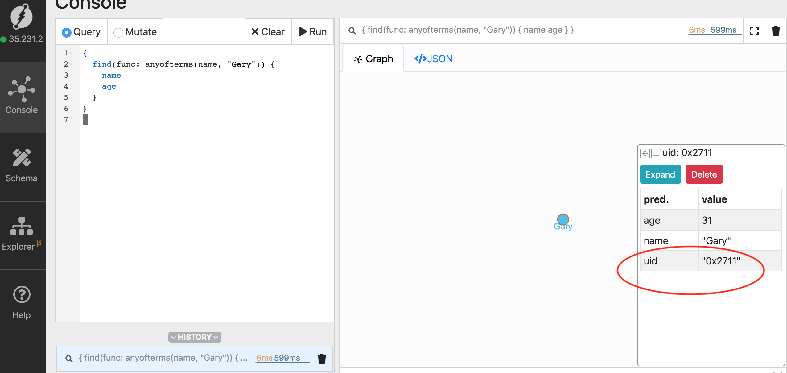

Here is the format of the query.
```sh
{
  <Any-function-name>(func: anyofterms(<string property/predicate>, "Value to search for")) {
    property-1/predicate-1 assocaited with the node  
     .
     .
     .
    property-n/predicate-1 assocaited with the node  
  }
}
```


Notice the `uid` property on the node when you click. As we had mentioned earlier, 
the temporary node ID get's replaced by the `unique Identifier (uid)` of the node internally, 
for any future references of the node the temp ID cannot be used, 
one need to use either a value of a predicate or the uid itself to refer to the node. 

Here is an example query using the uid of the node, copy the UID of the node from Ratel and 
use it in the following query, 

```
{
  find(func: uid(0x2711)) {
    uid
    name
    age
  }
}
```

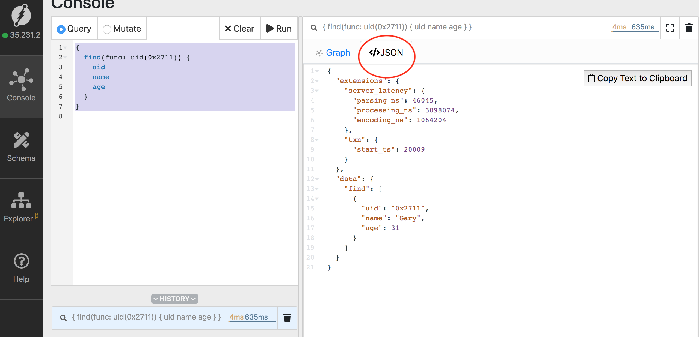

Notice the JSON tab on the right! 

The GraphQL syntax allows you to query for the fields you only need.

Note: The first step in querying Dgraph is to select a node or set of nodes based on certain criteria. 
Then let the diggy traverse from there.

Let's now select all the nodes with the predicate `name`, the `has` function can be used to 
identify all the nodes with a certain property/predicates.  

```
{
  find(func: has(name)) {
    uid
    name
    age
  }
}
```

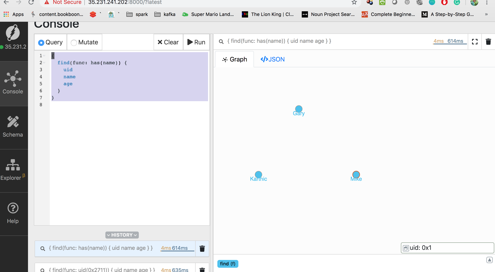

## Creating edges
As mentioned earlier, edges are first class citizens in Dgraph and integral part of your 
applciation data graph, let's see how to create an edge between these disconnected nodes. 

We have already defined an edge by name `friend` in our schema. We would be using the same format 
of mutation as earlier to create an edge. But now, instead of using temporary ID/Placeholder for 
nodes, we would be using the real uid of nodes to create an edge. Here is the format to create an 
edge between already existing nodes.

```sh
{
  set  {
<node-id-of-one-node> <name-of-edge-as-defined-in-schema> <node-id-of-another-node> .
  }
}
```

From the previous query containing `has` function, click on  nodes and get their UID's, 
let's pick the node ID's for Karthic and Gary. 

Here is the mutation to create a friend edge between Karthic and Gary (Use the node ID's/uid's from your setup).

```sh
{
  set {
    <0x2> <friend> <0x2711> .
  }
}
```

<0x2> is the uid of Karthic and the other is of Gary. This creates a friend edge from Karthic -> Gary! 

Now let's use the `has` function to find nodes which has a friend edge going out from it. 

```
{
  find(func: has(friend)) {
    uid
    name
    age
  }
}
```

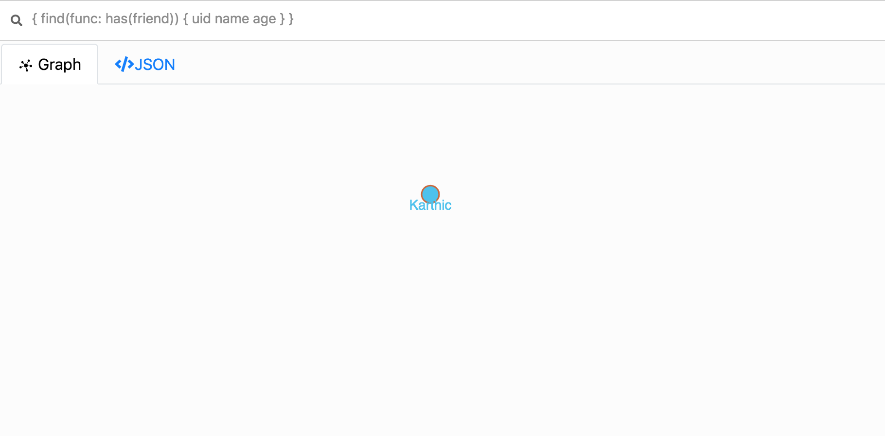

You could see that there is only one node from which a `friend` edge emerge from.

## Traversing the edges.
That's where the expressiveness of GraphQL comes handy. GraphQL's syntax makes graph exploration 
simple and intuitive. After all, it's a query language for Graphs :)

You could start with a root node as before and use a nested query block containing the name of the 
edge, this let's you to traverse using edges and land on nodes at the other end of the edge. 

Let's traverse the friend edge with the following query,

```sh
{
  find(func: anyofterms(name, "Karthic")) {
    uid
    name
    age
    friend {
      name 
      age
    }
  }
}

``` 

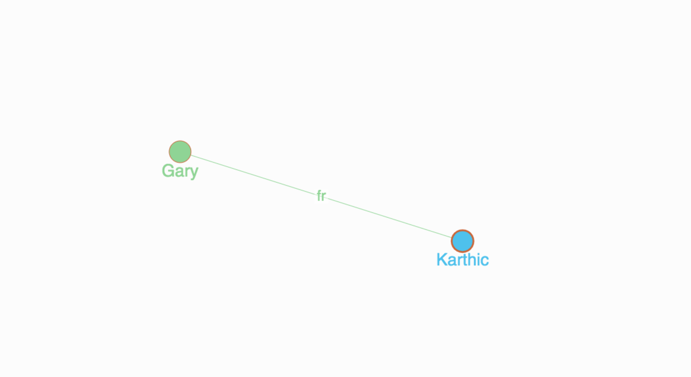

## Updating a node
Using a node's ID we could easily run a mutation to update the property/predicate of a node.
Let's modify the age of node with name "Karthic" from 28 to 27. The format is same as the mutations 
which we've used earlier, using the Node's ID is the key. 
```sh
{
  set {
    _:0x2 <age> "27" .
  }
}
```
The upsert API's which will be introduced in Dgraph 1.1v will make updation using the upsert API's.

## Deleting 
The `delete` keyword would be used to delete predicate/s. 

Again, the uid of a node could used for reference.

```sh
{
  delete {
     <0x2> * * .
  }
}

```
---   

# Basic tour

Now that we have acquired the necessary fundamentals, let's get started with Flock.  

As an appetizer you could also go through Dgraph's tour from [tour.dgraph.io](https://tour.dgraph.io)

---

